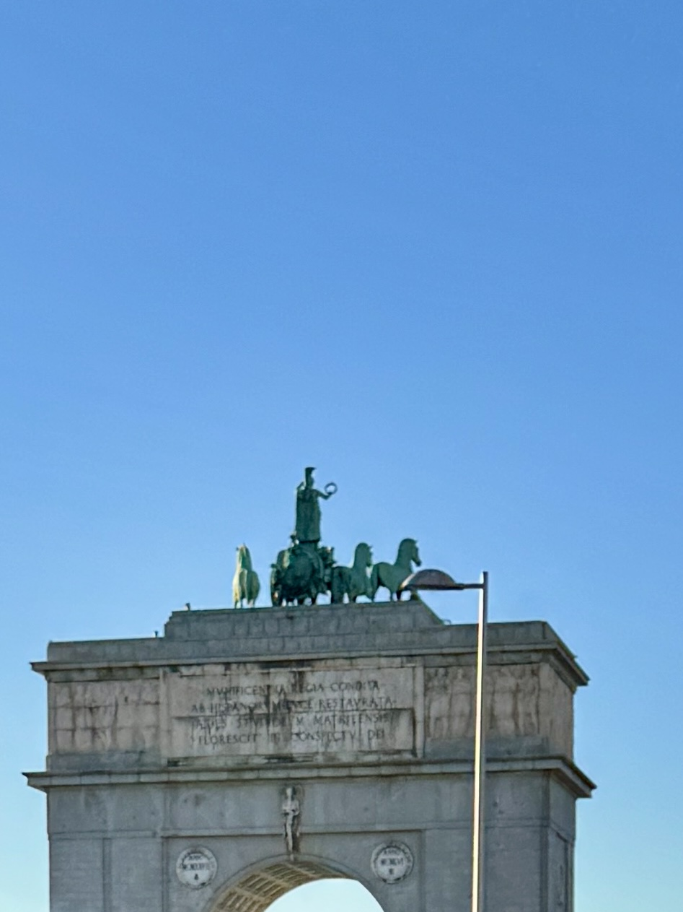
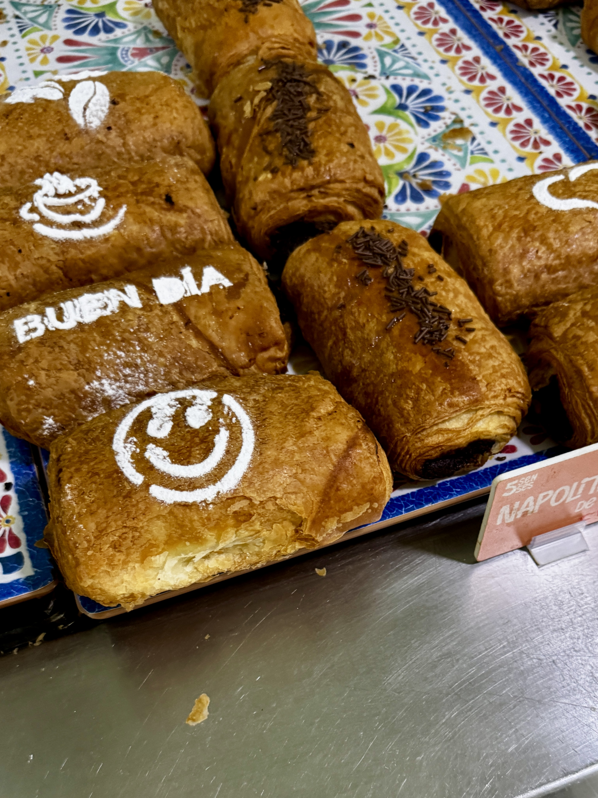
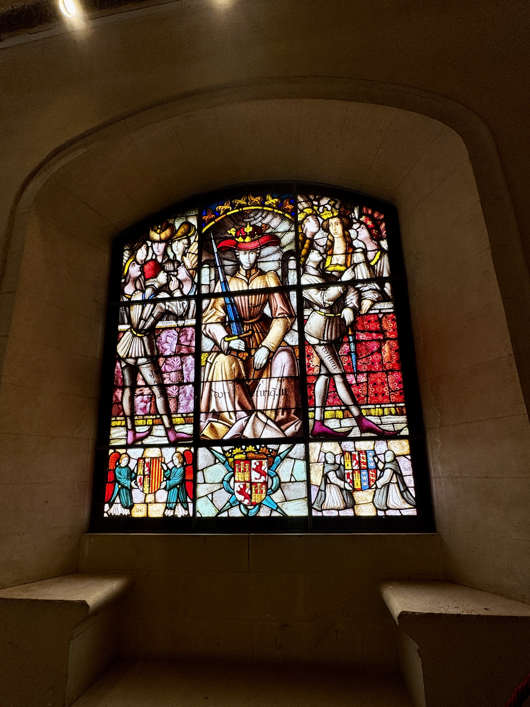
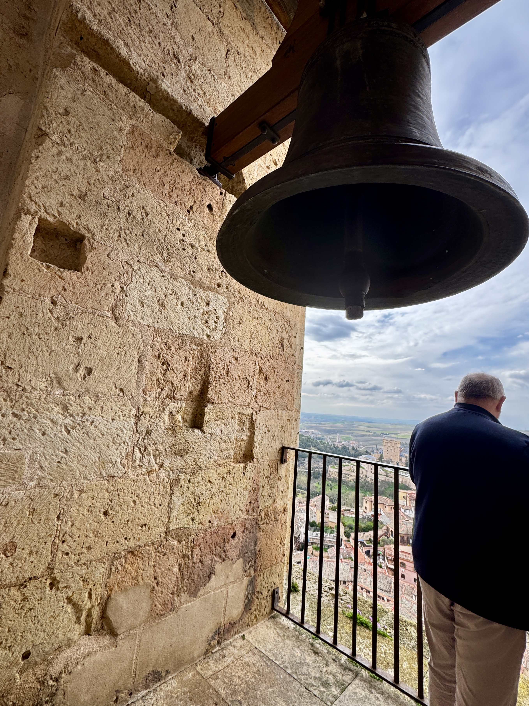
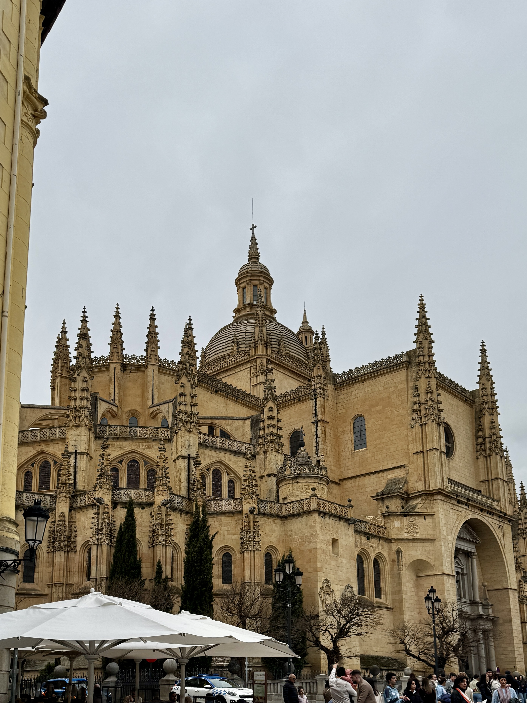
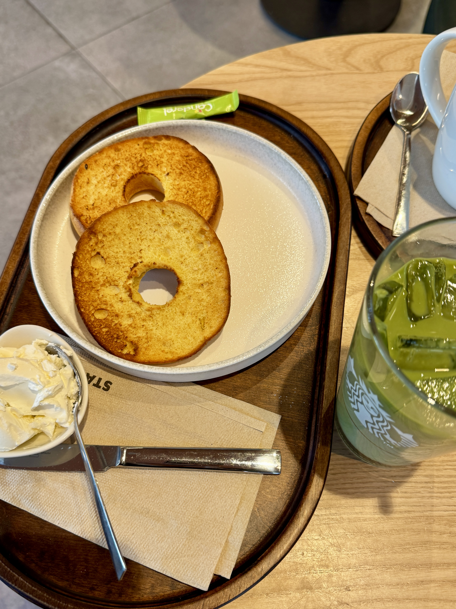
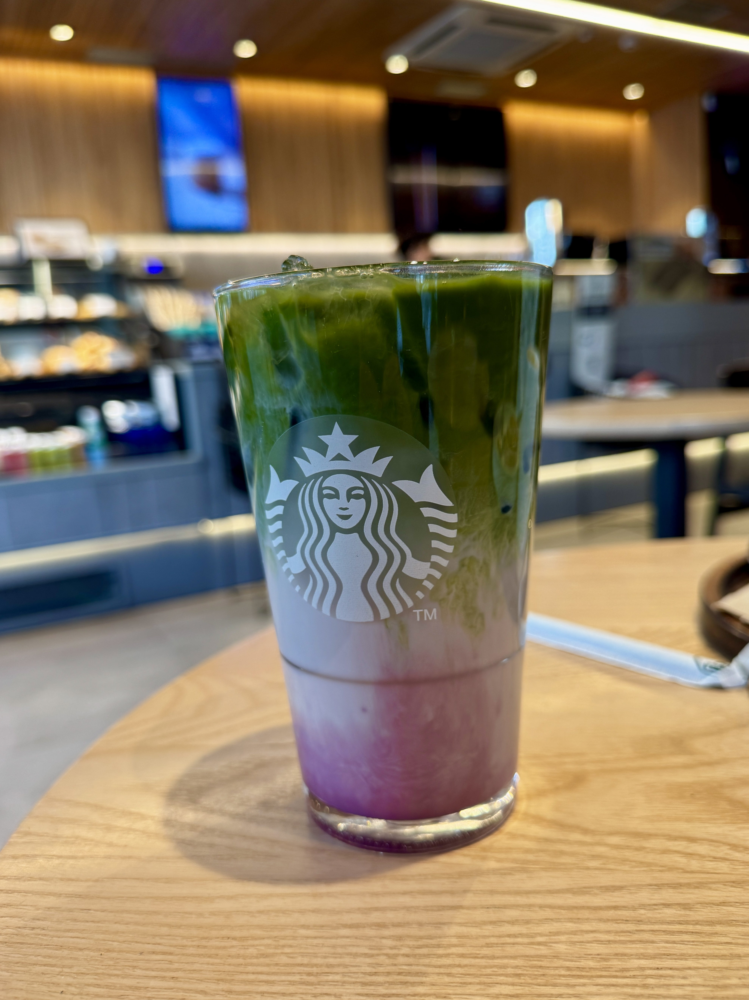

# Moments Abroad in Madrid, Spain 🫶🇪🇸

Catch flights, not feelings ✈️ \
A visual notebook of Madrid's streets, landmarks, and everyday corners.

---

## Episode 1: City Skylines & Sacred Spaces

Historic rooftops of Madrid at sunset, warm golden light layered over tiled roofs and a centuries-old skyline, Spain.

Ornate wrought-iron gates at the Royal Palace of Madrid framing the city's royal residence against a bright blue sky, Spain.

The neoclassical façade of Almudena Cathedral with twin bell towers set against a clear Madrid sky, Spain.

A narrow cobblestone street in old Madrid lined with traditional iron balconies and historic stone façades, Spain.

---

## Episode 2: Gothic Corners & Grand Museums

Gothic stone church entrance near the Prado Museum on a quiet rain-washed afternoon in central Madrid, Spain.

Street-level view of Gran Vía, Madrid's main commercial avenue, lined with early 20th-century architecture, cinemas, and city traffic, Spain.

Bronze monument to Miguel de Cervantes at Plaza de España, Madrid, with the Torre de Madrid skyscraper rising behind it against a hazy sky, Spain.

The classical stone façade and manicured gardens of the Museo del Prado in central Madrid, Spain.

---

## Episode 3: Blue Hour & Baroque Beauty

A modern multi-story Zara storefront glowing warmly at blue hour on Gran Vía, wet streets reflecting red and green traffic lights, Madrid, Spain.

The ornate frescoed façade of Casa de la Panadería in Plaza Mayor illuminated at dusk, twin spires and wrought-iron balconies bathed in golden light, Madrid, Spain.

Looking up between curved Belle Époque buildings with decorative stonework and ornate balconies on a central Madrid street, Spain.

A solemn bronze angel memorial sculpture set against a stone pillar in a quiet cobblestone plaza surrounded by historic yellow and brick buildings, Madrid, Spain.

---

## Episode 4: Campus Walks & Twilight Moments

A winding dirt path through a peaceful pine grove near Universidad Complutense de Madrid, bright green grass and soft overcast light, Spain.

A yellow stone neighborhood clock tower illuminated at blue hour, street lamp glowing orange, parked cars lining the street below, Madrid, Spain.

Interior of a large two-level university library with wooden shelving, fluorescent panel lighting, and rows of books on the upper floor, Madrid, Spain.

Modern wooden pergola structures in a park at twilight, metal chairs and an upturned umbrella in the foreground, moody blue-gray clouds overhead, Madrid, Spain.

---

## Episode 5: Golden Hours & Medieval Magic

Golden-hour sunset over a wide Madrid plaza lined with colorful historic buildings in yellow and orange tones, dramatic clouds illuminating the sky, Spain.

Large historic brick military building with a Spanish flag flying from the rooftop, classical symmetrical architecture and a bridge visible in the foreground, Madrid, Spain.

Panoramic view of Toledo perched on a hilltop peninsula surrounded by the Tagus River, medieval buildings cascading down the hillside with the Alcázar fortress at the top, Spain.

Close-up of an ornate stone archway with intricate carved details and a heraldic emblem above the arch, historic fortress walls visible through the opening, Toledo, Spain.

---

## Episode 6: Rooftops, Nights & Ancient Arches

Aerial view of Madrid city center at sunset, warm golden light over historic rooftops and Cines Callao at Plaza del Callao, Spain.

Nighttime street-level view of Gran Vía, Madrid's main boulevard, featuring illuminated historic architecture and Hotel Regente glowing against a dark sky, Spain.

Overcast morning view over a residential district in Madrid with sports courts, pine trees, and brick apartment buildings under a grey sky, Spain.

Bronze quadriga sculpture atop the Arco de la Victoria triumphal arch in Moncloa, Madrid, set against a clear blue sky, Spain.

---

## Episode 7: Puerta del Sol & the City That Believes in You

Upward street-level view of a narrow historic street in central Madrid with a vintage red hotel sign on a yellow building façade, iron balconies, and a dramatic cloudy blue sky above, Spain.

Bronze sculpture of El Oso y el Madroño, a bear standing against a strawberry tree and the official symbol of Madrid, at Puerta del Sol with the inscription "50 Años en Sol" on the base, Spain.

Daytime view of the Real Casa de Correos clock tower overlooking Puerta del Sol at golden hour, with a bronze equestrian statue of King Carlos III in the foreground and a jet contrail crossing the blue sky, Madrid, Spain.

Upward view of the cylindrical EY Tower with glass façade in Madrid's AZCA financial district, with El Corte Inglés signage and cypress trees in the foreground against a clear blue sky, Spain.

---

## Episode 8: Nights Out & Hidden Gems

Gold-lettered entrance of Gran Vía 84 hotel glowing against the night, marble columns and warm light spilling onto the avenue, Madrid, Spain.

The Ale-Hop corner store lit up after dark with a playful ferris wheel window display and red balloon décor, a pop of color against the stone façade, Madrid, Spain.

Professional broadcast control room with mixing boards and color-bar monitors, Madrid, Spain.

Ornate churrigueresque stone portal of the Museo de Historia de Madrid with intricate carved details against a coral-pink façade under an open blue sky, Spain.

---

## Episode 9: Buen Día & Bites Around the City

Golden flaky napolitana pastries dusted with powdered sugar smiley faces and chocolate sprinkles on a decorative tile tray at a bakery on Calle de Fuencarral, Madrid, Spain.

Two savory crêpes topped with fresh pico de gallo salsa and sliced avocado on white plates at a creperie on Calle de Fuencarral, Madrid, with a cortado and glass of water alongside, Spain.

Cheese fries loaded with bacon and nacho cheese sauce alongside mini montadito sandwiches and golden fried nuggets on black trays at 100 Montaditos, Madrid, Spain.

Colorful mochi ice cream display in Madrid featuring strawberry, matcha, chocolate, and cream flavors in a refrigerated glass case at a specialty dessert shop, Spain.

---

## Episode 10: Segovia — Roman Stone, Stained Glass & Gothic Spires

The Roman aqueduct of Segovia spanning the plaza, massive unmortared granite arches with townspeople strolling below and a Spanish flag above the central niche, diffused light under a partly cloudy sky, Spain.

Historic stained-glass window inside the Alcázar of Segovia, royal and heraldic panels including Enrique III of Castile with crown and sword, Castilian lions and castles, set in a deep stone recess, Spain.

View from a cathedral bell tower over Segovia's terracotta roofs, a massive bronze bell and stone wall in the foreground, the fairy-tale Alcázar rising above the old town and green hills on the horizon, Spain.

The late Gothic Catedral de Segovia with its ribbed dome, flying buttresses, and forest of pinnacles, seen from the plaza with café umbrellas, visitors, and a local police car at the foot of the façade, Spain.

---

## Episode 11: Matcha, Lattes & Quiet Café Corners

Toasted bagel halves with cream cheese on a speckled plate, wooden tray, and a tall iced matcha latte in a Starbucks glass on a light wood table, Madrid, Spain.

White mug of foamy latte with caramel crosshatch drizzle beside a glazed cinnamon roll on a ceramic plate, silverware on a napkin over a dark wood tray, casual café moment in Madrid, Spain.

Starbucks layered iced beverage—vibrant matcha, creamy milk, and bright purple syrup marbling in a condensation-beaded glass with the siren logo, bakery case and warm interior light behind, Madrid, Spain.

Blended white frappe topped with whipped cream next to seeded sourdough toast and a small dish of spread with spoon, arranged on a dark wooden tray for a light café breakfast, Madrid, Spain.

---

## Locations Featured

Iglesia de San Jerónimo el Real · Historic church near the Prado \
Gran Vía · Madrid's main shopping and entertainment avenue \
Plaza de España · Iconic square with the Cervantes monument \
Museo del Prado · World-renowned art museum \
Palacio Real de Madrid · The Royal Palace \
Catedral de la Almudena · Madrid's cathedral \
Centro Histórico · The historic city center \
Plaza Mayor · Central square with painted façades and arcades \
Universidad Complutense de Madrid · Campus and surrounding parks \
Toledo · Medieval hilltop city with river views and fortifications \
Plaza del Callao · Rooftop views over central Madrid at sunset \
Arco de la Victoria · Triumphal arch at Moncloa with bronze quadriga \
Puerta del Sol · Kilometer zero and one of Madrid's main squares \
El Oso y el Madroño · Bear and strawberry tree statue, symbol of the city \
Real Casa de Correos · Historic post office and clock tower in Puerta del Sol \
EY Tower & El Corte Inglés · Landmarks of Madrid's modern business district \
Mercado de San Miguel · Historic iron market near Plaza Mayor \
La Latina · Bohemian neighborhood, home to El Rastro Sunday flea market \
Parque del Retiro · Madrid's beloved central park and green lung \
Palacio de Cristal · Glass and iron palace within Retiro Park \
Jardines de Sabatini · Formal gardens bordering the Royal Palace \
Templo de Debod · Ancient Egyptian temple gifted to Spain, iconic sunset spot \
Calle de Fuencarral · Trendy shopping street in Malasaña and Chueca, lined with independent shops, bakeries, and creperies \
Segovia · Roman aqueduct, Alcázar, and Gothic cathedral on a hill-town day trip from Madrid \
Acueducto de Segovia · Two-tier Roman granite bridge, emblem of the city \
Alcázar de Segovia · Fortress-palace with royal stained glass and tower views \
Catedral de Segovia · Late Gothic “Lady of Cathedrals” with dome and pinnacles \
Starbucks (Madrid) · Study-session fuel—matcha, layered drinks, and café corners between classes \
Adolfo Suárez Madrid-Barajas Airport · Gateway in and out of the city

---

## A Note from the Photographer

Madrid doesn't just welcome you ... it absorbs you. It gets into the rhythm of your mornings, the route of your evening walks, the way you start saying *venga* at the end of every sentence without noticing. Every episode in this notebook is a small proof of that: that a city can feel like yours even when you're only borrowing it for a season.

If you ever find yourself with a one-way ticket and a half-charged camera, point it at Madrid. It will give you something worth keeping.

---

Madrid, you have my heart. 💃🏻
